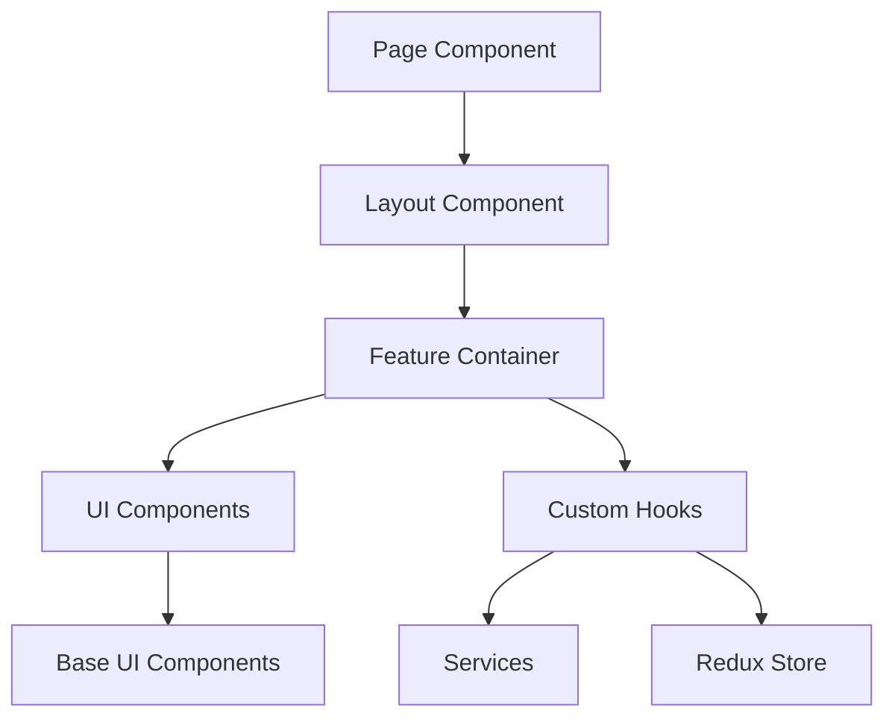
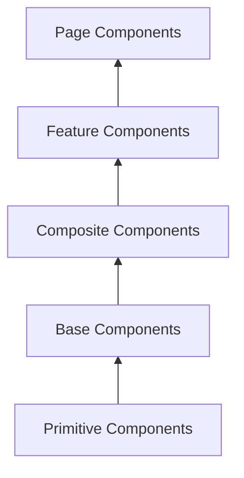
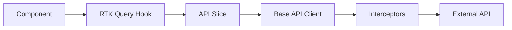
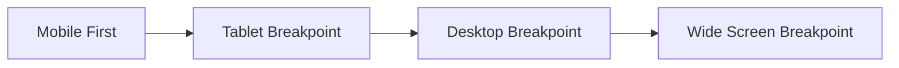
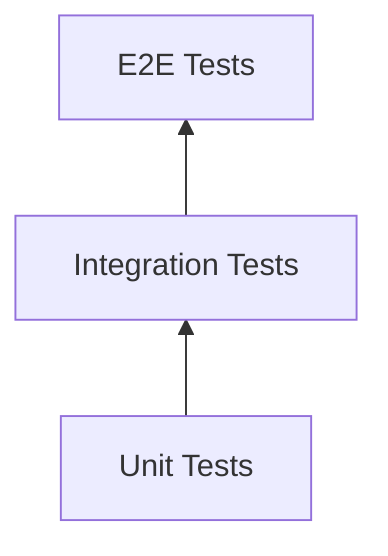
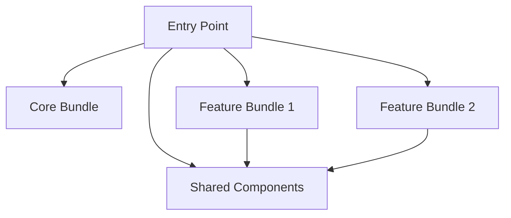
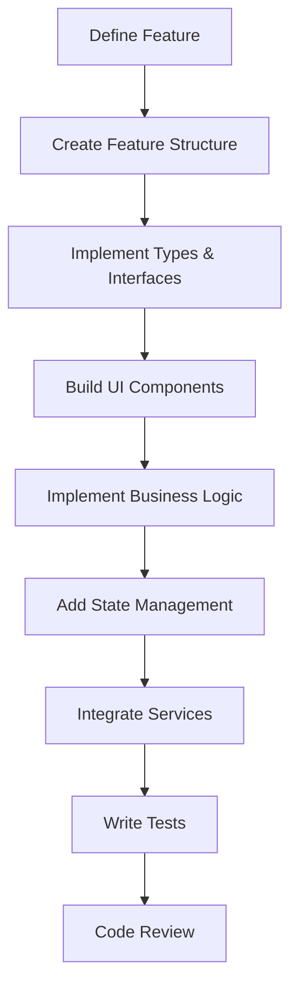

# Frontend Foundation Setup - UnifiedBeez

## Design Overview

This design establishes the architectural foundation for the UnifiedBeez frontend application, implementing a Feature-Based Architecture with Next.js, TypeScript, and Tailwind CSS. The foundation emphasizes scalability, maintainability, and adherence to SOLID principles through strategic abstraction and separation of concerns.

## Core Architectural Principles

### Feature-Based Architecture
The application organizes code by business features rather than technical layers, enabling:
- Independent feature development and deployment
- Clear domain boundaries
- Improved team collaboration
- Easier code navigation and maintenance

### Separation of Concerns (SoC)
UI components are strictly separated into:
- **Presentational Components**: Pure visual representation with no business logic
- **Container Components**: Business logic, state management, and data fetching
- **Custom Hooks**: Reusable stateful logic
- **Service Layer**: API communication and external integrations

### SOLID Principles Application

| Principle | Implementation Strategy |
|-----------|------------------------|
| Single Responsibility | Each component, hook, and utility has one clear purpose |
| Open/Closed | Components extend behavior through composition and props, not modification |
| Liskov Substitution | Component variants are interchangeable with their base types |
| Interface Segregation | Components receive only the props they need |
| Dependency Inversion | Components depend on abstractions (interfaces/types), not concrete implementations |

## Technology Stack

| Layer | Technology | Purpose |
|-------|------------|---------|
| Framework | Next.js 14+ | Server-side rendering, routing, and optimization |
| Language | TypeScript 5+ | Type safety and developer experience |
| Styling | Tailwind CSS 3+ | Utility-first styling with design system |
| State Management | Redux Toolkit | Centralized application state |
| API Layer | RTK Query | Data fetching and caching |

## Project Structure

### Root Directory Organization

```
UnifiedBeez/
├── src/
│   ├── app/                    # Next.js App Router pages and layouts
│   ├── features/               # Feature-based modules
│   ├── shared/                 # Shared resources across features
│   ├── core/                   # Core application infrastructure
│   └── types/                  # Global TypeScript definitions
├── public/
│   ├── images/                 # Static images
│   ├── logos/                  # Brand logos
│   └── icons/                  # Icon assets
├── config/                     # Configuration files
└── tests/                      # Test utilities and setup
```

### Feature Module Structure

Each feature follows a consistent internal structure:

```
features/[feature-name]/
├── components/                 # Feature-specific components
│   ├── ui/                    # Presentational components
│   └── containers/            # Container components
├── hooks/                      # Feature-specific custom hooks
├── services/                   # API and external service integration
├── store/                      # Redux slices and selectors
├── types/                      # Feature-specific TypeScript types
├── utils/                      # Feature-specific utilities
├── constants/                  # Feature-specific constants
└── index.ts                   # Public API exports
```

### Shared Module Structure

```
shared/
├── components/                 # Reusable UI components
│   ├── ui/                    # Base UI components (Button, Input, etc.)
│   ├── layout/                # Layout components (Header, Sidebar, etc.)
│   ├── forms/                 # Form components and controls
│   └── feedback/              # Feedback components (Toast, Modal, etc.)
├── hooks/                      # Shared custom hooks
├── utils/                      # Shared utility functions
├── services/                   # Shared services (auth, API client, etc.)
├── constants/                  # Application-wide constants
└── styles/                     # Global styles and theme
```

### Core Module Structure

```
core/
├── store/                      # Redux store configuration
├── api/                        # Base API client and interceptors
├── config/                     # Runtime configuration
├── providers/                  # React context providers
└── middleware/                 # Custom middleware
```

## Design System & Theming

### Color Palette Architecture

The design system implements a role-based color system with semantic naming and scale variations:

#### Primary Color Roles

| Role | Purpose | Scale Range |
|------|---------|-------------|
| Primary | Brand identity, primary actions | 50, 100, 200, 300, 400, 500, 600, 700, 800, 900 |
| Secondary | Secondary actions, accents | 50, 100, 200, 300, 400, 500, 600, 700, 800, 900 |
| Success | Positive feedback, confirmation | 50, 100, 200, 300, 400, 500, 600, 700, 800, 900 |
| Warning | Caution, attention needed | 50, 100, 200, 300, 400, 500, 600, 700, 800, 900 |
| Error | Errors, destructive actions | 50, 100, 200, 300, 400, 500, 600, 700, 800, 900 |
| Info | Informational messages | 50, 100, 200, 300, 400, 500, 600, 700, 800, 900 |

#### Neutral Color Roles

| Role | Purpose | Scale Range |
|------|---------|-------------|
| Background | Page and component backgrounds | light, lighter, dark, darker |
| Surface | Card and elevated surface backgrounds | light, lighter, dark, darker |
| Text | Text content | primary, secondary, tertiary, inverse |
| Border | Borders and dividers | light, medium, dark |

### Theme Structure

The theming system supports light and dark modes through CSS custom properties:

#### Theme Configuration Pattern

```
Theme Definition:
- Color tokens mapped to CSS variables
- Automatic switching based on user preference
- Persistent theme selection
- System preference detection
```

#### Tailwind Integration

Custom Tailwind configuration extends the default theme with:
- Semantic color tokens
- Consistent spacing scale
- Typography system
- Responsive breakpoints
- Animation utilities

## State Management Architecture

### Redux Toolkit Store Organization

```
core/store/
├── index.ts                    # Store configuration and exports
├── rootReducer.ts              # Combined reducers
└── middleware.ts               # Custom middleware setup

features/[feature]/store/
├── slice.ts                    # Feature slice with reducers and actions
├── selectors.ts                # Memoized selectors
├── thunks.ts                   # Async thunks
└── types.ts                    # State type definitions
```

### State Organization Principles

| Principle | Implementation |
|-----------|----------------|
| Slice Isolation | Each feature manages its own state slice independently |
| Selector Pattern | All state access through memoized selectors |
| Normalized State | Complex nested data stored in normalized form |
| Async Handling | RTK Query for server state, Redux for client state |
| Type Safety | Fully typed actions, state, and selectors |

### State Categories

| Category | Management Strategy | Example |
|----------|-------------------|---------|
| Server State | RTK Query | User data, API responses |
| Client State | Redux Toolkit | UI state, user preferences |
| Form State | Local component state or form libraries | Form inputs, validation |
| URL State | Next.js routing | Search params, route params |

## Component Architecture

### Component Hierarchy



### Component Types and Responsibilities

#### 1. Presentational Components (UI Components)

**Purpose**: Pure visual representation

**Characteristics**:
- Receive data and callbacks via props
- No direct state management or side effects
- Highly reusable and composable
- Fully testable in isolation

**Example Pattern**:
```
Component receives:
- Data props (display values)
- Event handler props (callbacks)
- Style/variant props (appearance customization)
- Children props (composition)

Component renders:
- Visual representation based on props
- No business logic
- Accessible HTML structure
```

#### 2. Container Components

**Purpose**: Business logic and state orchestration

**Characteristics**:
- Connect to Redux store
- Handle side effects
- Manage local component state
- Coordinate multiple UI components

**Example Pattern**:
```
Container responsibilities:
- Fetch data via hooks/selectors
- Handle user interactions
- Coordinate component communication
- Pass data to presentational components
```

#### 3. Custom Hooks

**Purpose**: Reusable stateful logic

**Characteristics**:
- Encapsulate specific functionality
- Composable and testable
- Follow React hooks rules
- Return consistent interface

**Categories**:
- Data fetching hooks
- State management hooks
- UI interaction hooks
- Side effect hooks
- Lifecycle hooks

### Component Abstraction Layers



| Layer | Description | Examples |
|-------|-------------|----------|
| Primitive | Fundamental HTML elements with minimal styling | Styled div, span, button base |
| Base | Reusable UI building blocks | Button, Input, Card, Badge |
| Composite | Combinations of base components | Form, DataTable, Modal |
| Feature | Feature-specific components | UserProfile, MessageThread |
| Page | Route-level components | Dashboard, Settings |

## Type System Architecture

### Type Organization

```
types/
├── global.d.ts                 # Global type augmentations
├── api/                        # API-related types
│   ├── requests.ts            # Request payload types
│   ├── responses.ts           # Response data types
│   └── errors.ts              # Error types
├── models/                     # Domain model types
│   ├── user.ts
│   ├── message.ts
│   └── ...
├── components/                 # Component prop types
└── utils/                      # Utility types
```

### Type Safety Principles

| Principle | Implementation |
|-----------|----------------|
| Strict Mode | Enable all strict TypeScript compiler options |
| No Implicit Any | Explicit typing for all variables and functions |
| Interface Segregation | Minimal, focused interfaces |
| Discriminated Unions | Type-safe conditional logic |
| Generic Constraints | Properly constrained generic types |

### Common Type Patterns

#### Props Interface Pattern
```
Component props defined with:
- Required vs optional properties
- Event handler types
- Children types
- Variant/style types
- Ref forwarding types
```

#### API Response Pattern
```
API responses typed with:
- Success response types
- Error response types
- Loading states
- Pagination metadata
```

#### Redux State Pattern
```
State slices typed with:
- Initial state interface
- Action payload types
- Selector return types
- Thunk argument types
```

## Service Layer Architecture

### Service Organization

```
services/
├── api/                        # API communication
│   ├── client.ts              # Base HTTP client
│   ├── interceptors.ts        # Request/response interceptors
│   └── endpoints.ts           # API endpoint definitions
├── auth/                       # Authentication services
├── storage/                    # Local/session storage
├── analytics/                  # Analytics integration
└── notifications/              # Notification services
```

### Service Abstraction Pattern

Each service provides:
1. **Interface Definition**: Abstract contract for service operations
2. **Implementation**: Concrete implementation of the interface
3. **Factory/Provider**: Dependency injection mechanism
4. **Error Handling**: Consistent error handling and reporting

### API Client Architecture



#### Request/Response Flow

1. Component invokes RTK Query hook
2. Hook dispatches API request through slice
3. Base client applies interceptors
4. Request sent to external API
5. Response intercepted for processing
6. Data normalized and cached
7. Component receives typed data

### Error Handling Strategy

| Error Type | Handling Approach |
|------------|------------------|
| Network Errors | Retry logic with exponential backoff |
| Authentication Errors | Token refresh or redirect to login |
| Validation Errors | Display field-level error messages |
| Server Errors | Display user-friendly error notification |
| Unknown Errors | Log to monitoring service, display generic message |

## Utility and Helper Organization

### Utility Categories

```
utils/
├── formatters/                 # Data formatting utilities
│   ├── date.ts
│   ├── currency.ts
│   └── text.ts
├── validators/                 # Validation utilities
│   ├── form.ts
│   └── business-rules.ts
├── transformers/               # Data transformation utilities
│   ├── api.ts
│   └── state.ts
├── helpers/                    # General helper functions
└── constants/                  # Constant values and enums
```

### Utility Design Principles

| Principle | Implementation |
|-----------|----------------|
| Pure Functions | No side effects, predictable outputs |
| Single Responsibility | Each utility has one clear purpose |
| Composability | Utilities can be combined easily |
| Type Safety | Fully typed inputs and outputs |
| Testability | Easily unit testable |

## Styling Architecture

### Tailwind CSS Configuration

The Tailwind configuration extends the default theme with:

#### Custom Theme Extensions

| Extension | Purpose |
|-----------|---------|
| Colors | Semantic color system with role-based naming |
| Spacing | Consistent spacing scale (4px base unit) |
| Typography | Font families, sizes, and line heights |
| Shadows | Elevation system for depth |
| Border Radius | Consistent corner radius scale |
| Breakpoints | Responsive design breakpoints |

### Component Styling Strategy

#### Styling Approaches by Component Type

| Component Type | Styling Approach |
|---------------|------------------|
| Base UI Components | Tailwind utility classes with variant patterns |
| Layout Components | Tailwind Grid/Flexbox utilities |
| Feature Components | Composition of base components |
| Complex Components | Combination of Tailwind and CSS modules when needed |

### CSS Custom Properties Usage

Custom properties provide:
- Theme variable abstraction
- Runtime theme switching
- Cascading theme values
- Dynamic color calculation

### Responsive Design Strategy



| Breakpoint | Min Width | Target Devices |
|------------|-----------|----------------|
| Mobile (default) | 0px | Phones |
| Tablet | 768px | Tablets |
| Desktop | 1024px | Laptops |
| Wide | 1440px | Large monitors |

## Configuration Management

### Environment Configuration

```
config/
├── env/                        # Environment-specific configurations
│   ├── development.ts
│   ├── staging.ts
│   └── production.ts
├── theme/                      # Theme configurations
├── api/                        # API endpoint configurations
└── features/                   # Feature flags
```

### Configuration Principles

| Principle | Implementation |
|-----------|----------------|
| Environment Separation | Separate configs for dev, staging, prod |
| Type Safety | All configs fully typed |
| Validation | Runtime validation of required values |
| Secrets Management | No secrets in code, use environment variables |
| Default Values | Sensible defaults with override capability |

## Testing Strategy

### Testing Pyramid



### Test Organization

```
tests/
├── unit/                       # Unit tests
├── integration/                # Integration tests
├── e2e/                        # End-to-end tests
├── utils/                      # Test utilities
└── fixtures/                   # Test data and mocks
```

### Testing Approach by Layer

| Layer | Testing Strategy | Tools |
|-------|-----------------|-------|
| UI Components | Visual and behavioral testing | Jest, React Testing Library |
| Custom Hooks | Hook behavior testing | React Hooks Testing Library |
| Services | API mocking and response testing | MSW, Jest |
| Redux Store | Action and reducer testing | Redux Toolkit Testing |
| Utilities | Pure function testing | Jest |

## Asset Management

### Public Assets Organization

```
public/
├── images/                     # General images
│   ├── backgrounds/
│   ├── illustrations/
│   └── photos/
├── logos/                      # Brand logos
│   ├── primary/
│   ├── secondary/
│   └── partners/
└── icons/                      # Icon assets
    ├── ui/
    ├── social/
    └── functional/
```

### Asset Optimization Strategy

| Asset Type | Optimization Approach |
|------------|---------------------|
| Images | Next.js Image component with automatic optimization |
| Icons | SVG components or icon font |
| Logos | SVG format for scalability |
| Fonts | Self-hosted with font-display: swap |

## Performance Optimization

### Code Splitting Strategy



### Optimization Techniques

| Technique | Implementation | Benefit |
|-----------|----------------|---------|
| Route-based Splitting | Next.js automatic code splitting | Smaller initial bundle |
| Component Lazy Loading | Dynamic imports for heavy components | Faster initial load |
| Image Optimization | Next.js Image component | Optimized delivery |
| Font Optimization | Next.js Font optimization | Reduced layout shift |
| Bundle Analysis | Regular bundle size monitoring | Identify bloat |

### Rendering Strategy

| Page Type | Rendering Method | Rationale |
|-----------|-----------------|-----------|
| Marketing Pages | Static Generation (SSG) | Best performance, SEO |
| Dashboard | Server-Side Rendering (SSR) | Personalized, fresh data |
| User Profiles | Incremental Static Regeneration (ISR) | Balance of performance and freshness |
| Real-time Features | Client-Side Rendering (CSR) | Dynamic, interactive |

## Accessibility Standards

### Compliance Target
WCAG 2.1 Level AA compliance across all components and features

### Accessibility Implementation

| Requirement | Implementation Strategy |
|-------------|------------------------|
| Semantic HTML | Use appropriate HTML elements |
| Keyboard Navigation | All interactive elements keyboard accessible |
| Screen Reader Support | ARIA labels and roles where needed |
| Color Contrast | Minimum 4.5:1 contrast ratio |
| Focus Management | Visible focus indicators |
| Alternative Text | Descriptive alt text for images |

### Accessibility Testing Approach

- Automated testing with axe-core
- Manual keyboard navigation testing
- Screen reader testing (NVDA, JAWS, VoiceOver)
- Color contrast validation
- Focus order verification

## Development Workflow

### Feature Development Flow



### Code Quality Standards

| Standard | Enforcement Method |
|----------|-------------------|
| TypeScript Strict Mode | Compiler configuration |
| ESLint Rules | Pre-commit hooks |
| Prettier Formatting | Automatic on save |
| Unit Test Coverage | CI/CD requirement |
| Component Documentation | Mandatory prop documentation |

## Security Considerations

### Security Measures

| Concern | Mitigation Strategy |
|---------|-------------------|
| XSS Attacks | React automatic escaping, CSP headers |
| CSRF Protection | Token-based authentication |
| Sensitive Data | No secrets in client code |
| Authentication | Secure token storage and refresh |
| API Security | Request signing, rate limiting |

### Secure Coding Practices

- Validate and sanitize all user inputs
- Use environment variables for sensitive configuration
- Implement proper authentication and authorization
- Regular dependency security audits
- HTTPS enforcement

## Scalability Considerations

### Horizontal Scalability

The architecture supports scaling through:
- **Independent Features**: Features can be developed and deployed independently
- **Code Splitting**: Reduced bundle sizes as application grows
- **Lazy Loading**: On-demand loading of features
- **Modular Structure**: New features follow established patterns

### Maintainability

| Aspect | Strategy |
|--------|----------|
| Code Organization | Clear feature boundaries |
| Documentation | Comprehensive inline and external docs |
| Conventions | Consistent naming and structure |
| Refactoring | Abstraction enables safe refactoring |
| Onboarding | Predictable structure reduces learning curve |

## Implementation Phases

### Phase 1: Foundation Setup
- Initialize Next.js project with TypeScript
- Configure Tailwind CSS with custom theme
- Set up Redux Toolkit store
- Create base project structure
- Configure development tools (ESLint, Prettier)

### Phase 2: Core Infrastructure
- Implement API client and interceptors
- Create authentication service
- Build base component library
- Set up theming system
- Establish type system foundation

### Phase 3: Shared Resources
- Develop shared UI components
- Implement common hooks
- Create utility functions
- Build layout components
- Set up global styles

### Phase 4: Feature Template
- Create feature template structure
- Document feature development guidelines
- Implement example feature
- Establish testing patterns

### Phase 5: Assets & Optimization
- Set up asset directories
- Configure image optimization
- Implement performance monitoring
- Establish build optimization

## Success Metrics

| Metric | Target | Measurement Method |
|--------|--------|-------------------|
| Bundle Size | < 200KB initial | Bundle analyzer |
| First Contentful Paint | < 1.5s | Lighthouse |
| Time to Interactive | < 3.5s | Lighthouse |
| Type Coverage | 100% | TypeScript compiler |
| Test Coverage | > 80% | Jest coverage reports |
| Accessibility Score | 100 | Lighthouse, axe-core |

## Maintenance and Evolution

### Versioning Strategy
- Semantic versioning for major architectural changes
- Feature flags for gradual rollouts
- Backward compatibility considerations

### Documentation Requirements
- Architecture decision records (ADRs)
- Component API documentation
- Feature development guides
- Contribution guidelines

### Continuous Improvement
- Regular architecture reviews
- Performance monitoring and optimization
- Dependency updates and security patches
- Refactoring based on patterns and pain points
